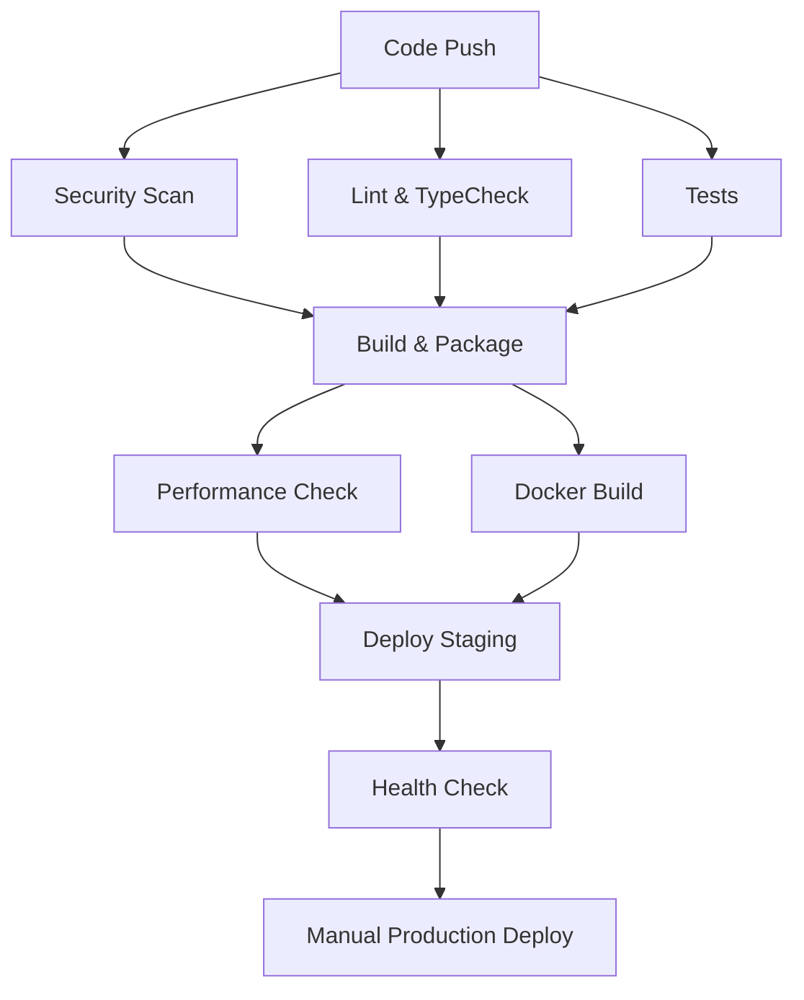

# CI/CD Setup and Configuration Guide

This document provides comprehensive instructions for setting up and configuring the CI/CD pipeline for projects created from the Phaser Game Template.

## Overview

The template includes a complete GitHub Actions CI/CD pipeline that provides:

- **Continuous Integration**: Automated testing, linting, and builds
- **Security Scanning**: Dependency vulnerability checks and code security analysis
- **Performance Testing**: Automated performance benchmarks and monitoring
- **Automated Deployment**: Staging and production deployment workflows
- **Health Monitoring**: Automated health checks and reporting
- **Container Support**: Docker-based builds and deployment

## Quick Start

### 1. Initial Setup

When creating a new project from this template:

```bash
# Clone your new repository
git clone https://github.com/your-username/your-game-project.git
cd your-game-project

# Install dependencies
npm install

# Verify CI/CD setup
npm run test:github-actions:quick
```

### 2. Required Repository Settings

Configure these settings in your GitHub repository:

1. **Actions**: Enable GitHub Actions (should be enabled by default)
2. **Secrets**: Add required secrets (see [Required Secrets](#required-secrets))
3. **Environments**: Create `staging` and `production` environments
4. **Branch Protection**: Configure protection rules for `main` branch

## Workflow Overview

### Main Workflows

| Workflow | Trigger | Purpose | Duration |
|----------|---------|---------|----------|
| `ci.yml` | Push/PR to main/develop | Full CI pipeline with tests and builds | ~8-10 minutes |
| `security-scan.yml` | Push/PR/Schedule | Security vulnerability scanning | ~3-5 minutes |
| `deploy-staging.yml` | Push to main | Deploy to staging environment | ~5-7 minutes |
| `deploy-production.yml` | Manual trigger | Deploy to production environment | ~5-7 minutes |
| `performance-advanced.yml` | Schedule/Manual | Advanced performance testing | ~10-15 minutes |
| `health-monitoring.yml` | Schedule | Health checks and monitoring | ~2-3 minutes |

### CI Pipeline Stages



## Required Secrets

Configure these secrets in your GitHub repository settings (`Settings` > `Secrets and variables` > `Actions`):

### Essential Secrets

```bash
# GitHub token (automatically provided)
GITHUB_TOKEN  # No setup required - provided by GitHub

# Deployment secrets (configure based on your hosting)
DEPLOYMENT_KEY          # SSH key or API token for deployment
STAGING_DEPLOY_URL      # Staging deployment endpoint
PRODUCTION_DEPLOY_URL   # Production deployment endpoint
```

### Optional Secrets (based on your setup)

```bash
# Third-party service integrations
VERCEL_TOKEN           # If using Vercel for deployment
NETLIFY_AUTH_TOKEN     # If using Netlify for deployment
AWS_ACCESS_KEY_ID      # If using AWS for deployment
AWS_SECRET_ACCESS_KEY  # If using AWS for deployment

# Monitoring and analytics
SENTRY_AUTH_TOKEN      # If using Sentry for error tracking
DISCORD_WEBHOOK_URL    # If using Discord for notifications
SLACK_WEBHOOK_URL      # If using Slack for notifications
```

## Environment Variables

Configure these in your repository environments (`Settings` > `Environments`):

### Staging Environment

```bash
NODE_ENV=staging
GAME_API_URL=https://api-staging.yourgame.com
SENTRY_ENVIRONMENT=staging
```

### Production Environment

```bash
NODE_ENV=production
GAME_API_URL=https://api.yourgame.com
SENTRY_ENVIRONMENT=production
```

## Local Testing

### Prerequisites

```bash
# Required
Node.js 22 or later
npm (latest version)

# Optional (for full testing)
Docker Desktop
```

### Quick Compatibility Check

```bash
# Test basic CI compatibility (fastest)
npm run test:github-actions:enhanced:quick

# Test full CI pipeline locally
npm run test:github-actions:enhanced

# Test only CI compatibility
npm run test:ci-compatibility

# Verify CI/CD setup and configuration
npm run verify:ci-setup

# Full CI verification with all checks
npm run verify:ci-setup:full
```

### Advanced Testing Options

```bash
# Docker-only test
npm run test:github-actions:enhanced -- --docker-only

# Verbose output for debugging
npm run test:github-actions:enhanced -- --verbose

# Help for all options
npm run test:github-actions:enhanced -- --help
```

### Using act (Advanced Local Testing)

Install [act](https://github.com/nektos/act) for advanced local GitHub Actions testing:

```bash
# Install act (macOS)
brew install act

# Install act (Windows)
choco install act-cli

# Install act (Linux)
curl https://raw.githubusercontent.com/nektos/act/master/install.sh | sudo bash

# Test specific workflow
act -j build-and-push

# Test with secrets
act -j deploy-staging --secret-file .secrets
```

## Customization

### Adding New Workflows

1. Create a new workflow file in `.github/workflows/`
2. Follow the existing patterns for consistency
3. Test locally before committing
4. Update this documentation

Example workflow structure:

```yaml
name: Your Workflow Name

permissions:
  contents: read
  # Add other permissions as needed

on:
  # Define triggers

jobs:
  your-job:
    runs-on: ubuntu-latest
    timeout-minutes: 10
    steps:
      - name: Checkout code
        uses: actions/checkout@v4
      
      # Add your steps here
```

### Modifying Existing Workflows

1. **Test locally first**: Use the local testing scripts
2. **Update in small increments**: Make small, testable changes
3. **Monitor the first run**: Watch the first GitHub Actions run carefully
4. **Rollback if needed**: Keep previous working versions for rollback

### Environment-Specific Configuration

Create environment-specific configuration files:

```bash
# environments/development.json
{
  "api": {
    "baseUrl": "http://localhost:3000",
    "timeout": 5000
  },
  "features": {
    "debugMode": true,
    "mockData": true
  }
}

# environments/production.json
{
  "api": {
    "baseUrl": "https://api.yourgame.com",
    "timeout": 10000
  },
  "features": {
    "debugMode": false,
    "mockData": false
  }
}
```

## Deployment Strategies

### Staging Deployment

- **Trigger**: Automatic on push to `main`
- **Environment**: `staging`
- **URL**: Configured in `STAGING_DEPLOY_URL`
- **Features**: Full testing, performance monitoring

### Production Deployment

- **Trigger**: Manual approval required
- **Environment**: `production`
- **URL**: Configured in `PRODUCTION_DEPLOY_URL`
- **Features**: Blue-green deployment, rollback support

### Rollback Procedure

```bash
# Automated rollback (if configured)
npm run rollback

# Manual rollback
git revert <commit-hash>
git push origin main
```

## Performance Monitoring

### Automated Checks

- **Bundle size analysis**: Alerts if bundle exceeds thresholds
- **Performance benchmarks**: Automated performance testing
- **Memory usage**: Monitoring for memory leaks
- **Load time analysis**: Critical rendering path optimization

### Performance Thresholds

```typescript
// config/monitoring/health-thresholds.json
{
  "performance": {
    "bundleSize": {
      "maxSizeMB": 10,
      "warningThresholdMB": 8
    },
    "loadTime": {
      "maxLoadTimeMs": 3000,
      "warningThresholdMs": 2000
    },
    "fps": {
      "minFPS": 55,
      "targetFPS": 60
    }
  }
}
```

## Security Configuration

### Dependency Scanning

- **npm audit**: Automated vulnerability scanning
- **better-npm-audit**: Enhanced security analysis
- **GitHub Dependabot**: Automated dependency updates

### Code Security

- **ESLint security rules**: Code security linting
- **Secret scanning**: Prevent secret commits
- **SAST analysis**: Static application security testing

### Security Best Practices

1. **Keep dependencies updated**: Regular dependency updates
2. **Use security linting**: ESLint security plugin enabled
3. **Scan for secrets**: Never commit secrets to repository
4. **Review security alerts**: Address Dependabot alerts promptly

## Troubleshooting

### Common Issues

#### Build Failures

```bash
# Check build locally
npm run build

# Clear cache and rebuild
npm run clean
npm install
npm run build
```

#### Test Failures

```bash
# Run tests locally
npm run test:run

# Run tests with coverage
npm run test:coverage

# Run E2E tests
npm run test:e2e
```

#### Docker Issues

```bash
# Test Docker build locally
docker build -t test-build .

# Check Docker logs
docker logs <container-id>

# Reset Docker environment
docker system prune -a
```

#### Deployment Issues

```bash
# Check deployment logs in GitHub Actions
# Verify environment variables are set correctly
# Test deployment scripts locally

# Manual deployment test
npm run deploy:staging -- --dry-run
```

### Getting Help

1. **Check workflow logs**: Review detailed logs in GitHub Actions
2. **Test locally**: Use the provided testing scripts
3. **Review documentation**: Check this guide and inline comments
4. **Search issues**: Check the template repository for similar issues

## Maintenance

### Regular Tasks

- **Weekly**: Review security alerts and update dependencies
- **Monthly**: Update GitHub Actions versions and review performance metrics
- **Quarterly**: Review and optimize workflow configurations

### Health Monitoring

```bash
# Generate health report
npm run health:report

# Check technical debt
npm run health:debt

# Monitor system health
npm run health:check
```

### Updates and Upgrades

1. **GitHub Actions**: Update action versions regularly
2. **Dependencies**: Keep npm packages updated
3. **Node.js**: Update Node.js version as needed
4. **Security patches**: Apply security updates promptly

## Advanced Configuration

### Matrix Builds

Configure matrix builds for multiple environments:

```yaml
strategy:
  matrix:
    node-version: [22, 23]
    os: [ubuntu-latest, macos-latest, windows-latest]
```

### Custom Deployment Providers

Integrate with your preferred deployment provider:

```yaml
# Vercel deployment
- name: Deploy to Vercel
  uses: amondnet/vercel-action@v25
  with:
    vercel-token: ${{ secrets.VERCEL_TOKEN }}
    vercel-org-id: ${{ secrets.ORG_ID }}
    vercel-project-id: ${{ secrets.PROJECT_ID }}

# AWS deployment
- name: Deploy to AWS
  uses: aws-actions/configure-aws-credentials@v4
  with:
    aws-access-key-id: ${{ secrets.AWS_ACCESS_KEY_ID }}
    aws-secret-access-key: ${{ secrets.AWS_SECRET_ACCESS_KEY }}
    aws-region: us-east-1
```

### Notifications

Configure deployment notifications:

```yaml
# Discord notification
- name: Discord notification
  if: always()
  uses: Ilshidur/action-discord@master
  env:
    DISCORD_WEBHOOK: ${{ secrets.DISCORD_WEBHOOK_URL }}
  with:
    args: 'Deployment completed with status: ${{ job.status }}'
```

## Conclusion

This CI/CD pipeline provides a robust foundation for game development with automated testing, security scanning, and deployment. Regular maintenance and monitoring ensure optimal performance and security.

For questions or issues, refer to the troubleshooting section or check the template repository's issue tracker.
